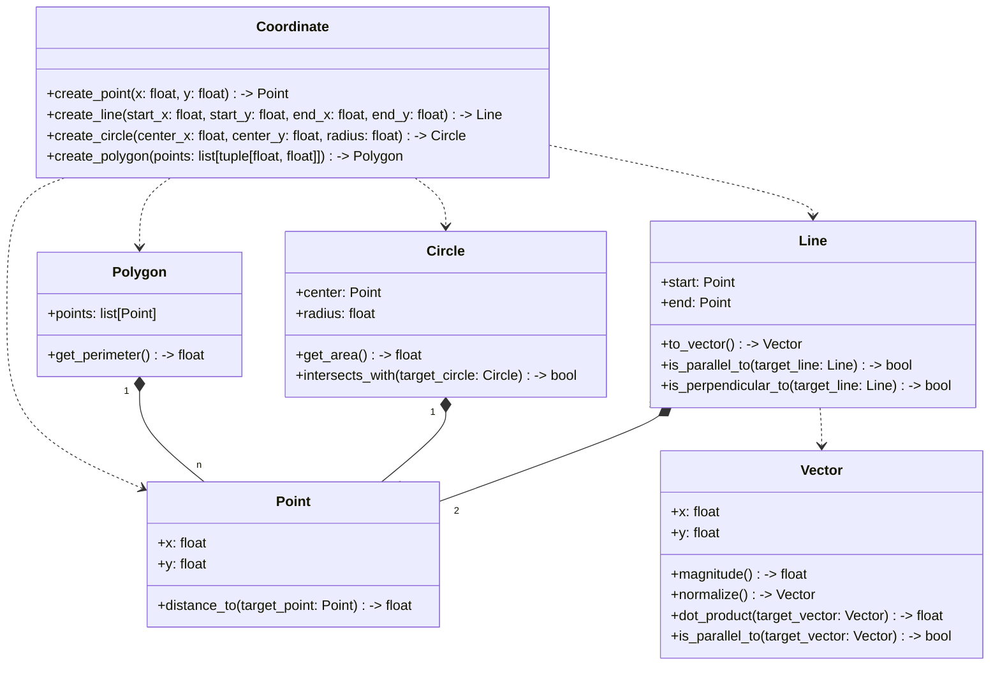

# we-help-deep-learning
Official repository for the WeHelp Deep Learning Camp 6th

## Week 2: Geometric Objects
This project implements geometric calculations including lines, circles, and polygons.

### Class Diagram

### Features
- Line parallel and perpendicular detection
- Circle area calculation and intersection detection
- Polygon perimeter calculation
