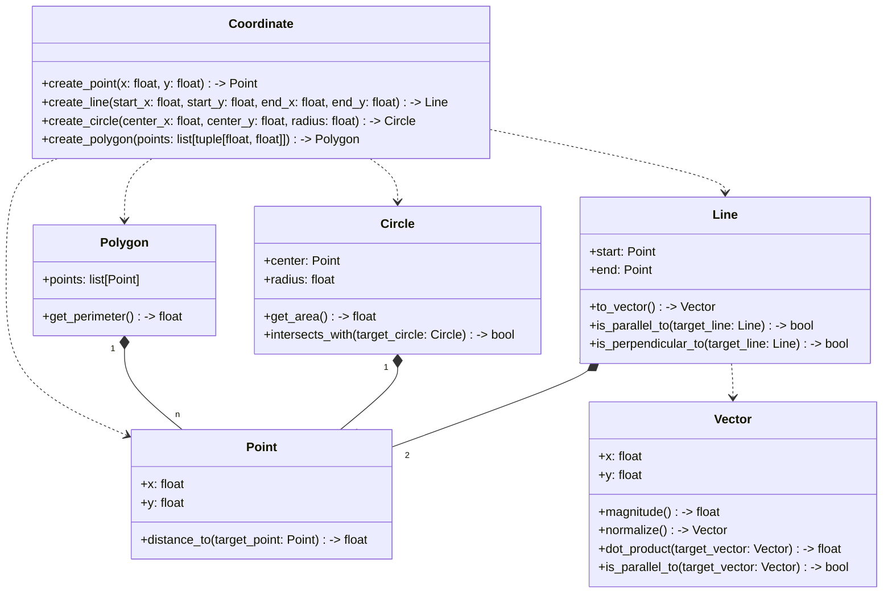
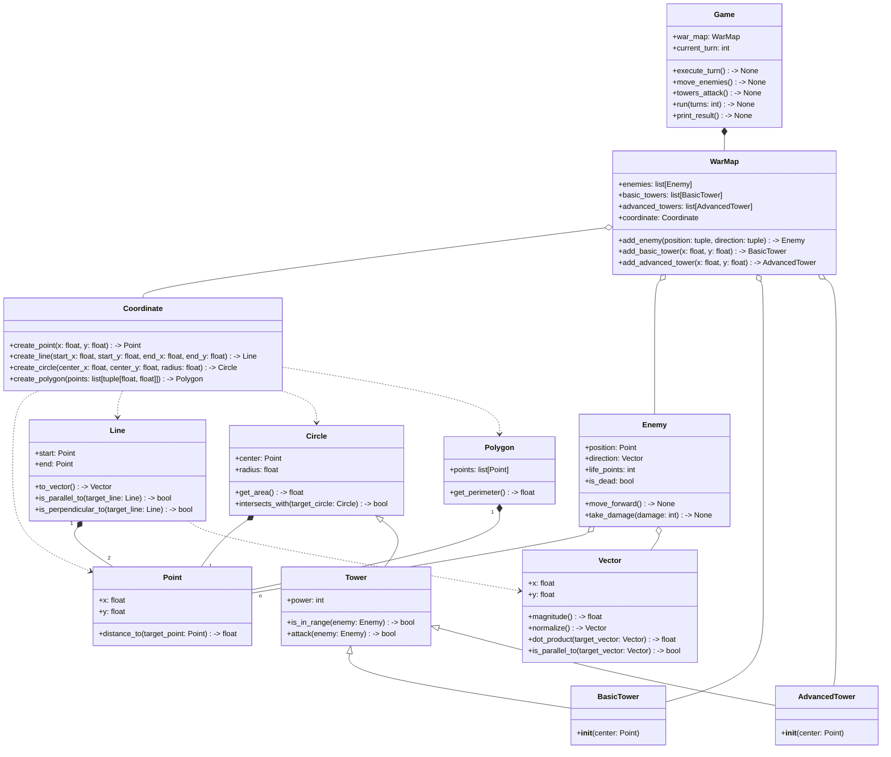

# we-help-deep-learning
Official repository for the WeHelp Deep Learning Camp 6th

## Week 2: Geometric Objects

### Task1 Class Diagram

```mermaid
classDiagram
    class Point {
        +x: float
        +y: float
        +distance_to(target_point: Point) -> float
    }

    class Vector {
        +x: float
        +y: float
        +magnitude() -> float
        +normalize() -> Vector
        +dot_product(target_vector: Vector) -> float
        +is_parallel_to(target_vector: Vector) -> bool
    }

    class Line {
        +start: Point
        +end: Point
        +to_vector() -> Vector
        +is_parallel_to(target_line: Line) -> bool
        +is_perpendicular_to(target_line: Line) -> bool
    }

    class Circle {
        +center: Point
        +radius: float
        +get_area() -> float
        +intersects_with(target_circle: Circle) -> bool
    }

    class Polygon {
        +points: list[Point]
        +get_perimeter() -> float
    }

    class Coordinate {
        +create_point(x: float, y: float) -> Point
        +create_line(start_x: float, start_y: float, end_x: float, end_y: float) -> Line
        +create_circle(center_x: float, center_y: float, radius: float) -> Circle
        +create_polygon(points: list[tuple[float, float]]) -> Polygon
    }

    Line "1" *-- "2" Point
    Circle "1" *-- "1" Point
    Polygon "1" *-- "n" Point
    Line ..> Vector
    Coordinate ..> Point
    Coordinate ..> Line
    Coordinate ..> Circle
    Coordinate ..> Polygon
```

### Task2 Class Diagram (extend task1)

```mermaid
classDiagram
    class Point {
        +x: float
        +y: float
        +distance_to(target_point: Point) -> float
    }

    class Vector {
        +x: float
        +y: float
        +magnitude() -> float
        +normalize() -> Vector
        +dot_product(target_vector: Vector) -> float
        +is_parallel_to(target_vector: Vector) -> bool
    }

    class Line {
        +start: Point
        +end: Point
        +to_vector() -> Vector
        +is_parallel_to(target_line: Line) -> bool
        +is_perpendicular_to(target_line: Line) -> bool
    }

    class Circle {
        +center: Point
        +radius: float
        +get_area() -> float
        +intersects_with(target_circle: Circle) -> bool
    }

    class Polygon {
        +points: list[Point]
        +get_perimeter() -> float
    }

    class Coordinate {
        +create_point(x: float, y: float) -> Point
        +create_line(start_x: float, start_y: float, end_x: float, end_y: float) -> Line
        +create_circle(center_x: float, center_y: float, radius: float) -> Circle
        +create_polygon(points: list[tuple[float, float]]) -> Polygon
    }

    class Tower {
        +power: int
        +is_in_range(enemy: Enemy) -> bool
        +attack(enemy: Enemy) -> bool
    }

    class BasicTower {
        +__init__(center: Point)
    }

    class AdvancedTower {
        +__init__(center: Point)
    }

    class Enemy {
        +position: Point
        +direction: Vector
        +life_points: int
        +is_dead: bool
        +move_forward() -> None
        +take_damage(damage: int) -> None
    }

    class WarMap {
        +enemies: list[Enemy]
        +basic_towers: list[BasicTower]
        +advanced_towers: list[AdvancedTower]
        +coordinate: Coordinate
        +add_enemy(position: tuple, direction: tuple) -> Enemy
        +add_basic_tower(x: float, y: float) -> BasicTower
        +add_advanced_tower(x: float, y: float) -> AdvancedTower
    }

    class Game {
        +war_map: WarMap
        +current_turn: int
        +execute_turn() -> None
        +move_enemies() -> None
        +towers_attack() -> None
        +run(turns: int) -> None
        +print_result() -> None
    }

    Line "1" *-- "2" Point
    Circle "1" *-- "1" Point
    Polygon "1" *-- "n" Point
    Line ..> Vector
    Coordinate ..> Point
    Coordinate ..> Line
    Coordinate ..> Circle
    Coordinate ..> Polygon
    Circle <|-- Tower
    Tower <|-- BasicTower
    Tower <|-- AdvancedTower
    Enemy o-- Point
    Enemy o-- Vector
    WarMap o-- Coordinate
    WarMap o-- Enemy
    WarMap o-- BasicTower
    WarMap o-- AdvancedTower
    Game *-- WarMap
```
